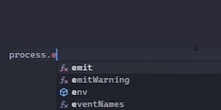

# envsense README

## Features

Simply adds all the variables from your .env file to `process.env` autocomplete.

## Requirements

* VSCode v1.38.0 or later

## Extension Settings

This extension contributes the following settings:

* `envSense.ignoreDefaults`: Only shows values from .env files in process.env and not system environment variables

## Not working?

Check the [valid files list](/validfiles.txt) for a list of valid `.env` files

If it is still not working, create an issue [here](github.com/jamesinaxx/vscode-envsense)

## Known Issues

None as of now

## Release Notes

Users appreciate release notes as you update your extension.

### 1.0.0

Initial release of Env Sense

**Enjoy!**
